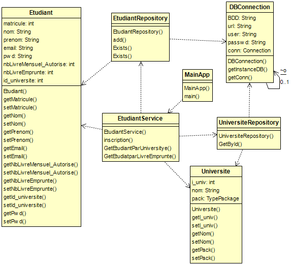
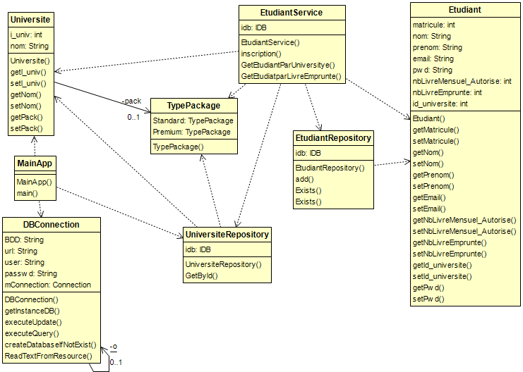

#solution

+ 1 ok open project
+ 2 ok create github repo
+ 3 ok
	+ 
+ 4 ok singleton
+ 5 ok commit

----------------------------------------------------------

+ 6 ok
	+ IOC for class DBConnection
	+ create function auto generate database
	+ improve this code
	+ 
+ 7 ok edit main
+ 8 ok commit

----------------------------------------------------------

+ 9 ok create 4 class using class 4 as composit patren
+ 10 ok edit main and run IJornal
+ 11 ok commit
